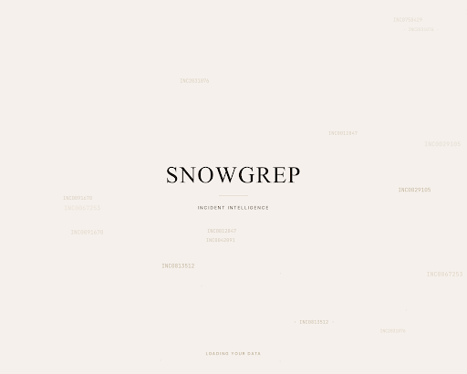
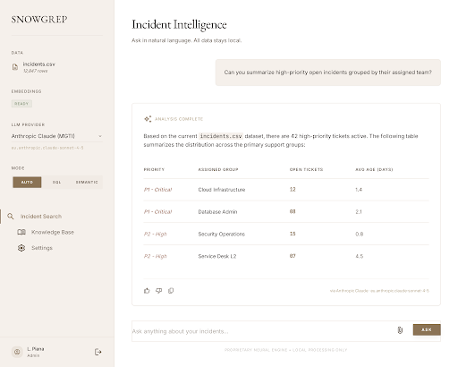
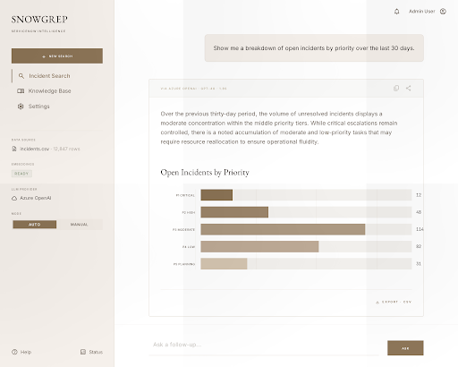

# ServiceNow Incident Query Tool

A local Python application that enables natural language querying of ServiceNow incident CSV exports.

**Created by Kevin "Overlord of AI Bespoke Apps" Taylor**

## Features

- **CSV Import**: Upload ServiceNow incident exports with automatic schema detection
- **Password-Protected Upload**: Secure file uploads with configurable password
- **SQL Queries**: Ask structured questions in plain English (e.g., "Show all P1 incidents from last month")
- **Semantic Search**: Find similar incidents using natural language (e.g., "Find incidents like Outlook crashes")
- **Chart Visualization**: Generate pie, bar, and line charts from query results
- **Intelligent Routing**: Automatically routes queries to the best search method

## Screenshots

The v2.2 visual surface follows the in-house `loro-piana-aesthetic` design system — EB Garamond + Inter typography, warm-beige page, charcoal body, muted-gold accents.


*Splash screen — 4-second animated geometric helix in muted gold before the first frame renders.*


*Main chat surface — small-caps tracked sidebar labels, editorial typography in the chat input, ghost example queries below.*


*Results + chart surface — editorial table with EB Garamond column heads, expandable "EXPAND · INTERACTIVE VIEW" view, restyled chart with charcoal axes and vibrant categorical marks.*

## Tech Stack

- **Python 3.11** (recommended - best compatibility with ML packages)
- **DuckDB** - Fast SQL queries on local data
- **ChromaDB** - Vector embeddings for semantic search
- **sentence-transformers** - Local embedding generation
- **Azure OpenAI or Anthropic Claude (via MGTI Apigee gateway)** - Query routing, SQL generation, and executive summaries; selectable per session in the sidebar (default: Azure OpenAI)
- **Altair** - Interactive chart visualization
- **Streamlit** - Web interface

## Quick Start

1. **Create virtual environment** (Python 3.11 recommended):
   ```bash
   python3.11 -m venv venv
   source venv/bin/activate  # On Windows: venv\Scripts\activate
   ```

2. **Install dependencies**:
   ```bash
   pip install -r requirements.txt
   ```

3. **Configure Azure OpenAI**:
   ```bash
   cp .env.example .env
   # Edit .env with your Azure OpenAI credentials
   ```

4. **Run the app**:
   ```bash
   streamlit run app.py
   ```

5. **Upload data**: Use the sidebar to upload a ServiceNow CSV export

## Project Structure

```
snow_query/
├── app.py                 # Streamlit entry point
├── config.py              # Configuration settings
├── data/                  # CSV uploads (runtime)
├── db/                    # DuckDB and ChromaDB persistence
├── src/
│   ├── ingest.py          # CSV → DuckDB loader
│   ├── embeddings.py      # Vector embeddings
│   ├── query_router.py    # Intent classification
│   ├── sql_generator.py   # NL → SQL
│   ├── semantic_search.py # Vector similarity search
│   └── utils.py           # Utilities
├── requirements.txt
└── README.md
```

## Environment Variables

| Variable | Description | Default |
|----------|-------------|---------|
| `AZURE_OPENAI_ENDPOINT` | Azure OpenAI endpoint URL | (required for Azure) |
| `AZURE_OPENAI_API_KEY` | Azure OpenAI API key | (required for Azure) |
| `API_VERSION` | Azure API version | 2023-05-15 |
| `LLM_PROVIDER_DEFAULT` | Default LLM provider for new sessions. Options: `azure_openai`, `anthropic_mgti` | `azure_openai` |
| `ANTHROPIC_BASE_URL` | MGTI Apigee gateway base URL (e.g. `https://stage.int.nasa.apis.mmc.com/coreapi/llm/anthropic/v1`) | (required for Anthropic) |
| `ANTHROPIC_API_KEY` | MGTI API key (issued via Hubble — see below) | (required for Anthropic) |
| `ANTHROPIC_MODEL` | Claude model identifier; MUST start with `eu.anthropic.claude-` (Claude 4.5+, EU Bedrock) | (required for Anthropic) |
| `ANTHROPIC_VERSION` / `ANTHROPIC_MAX_TOKENS` / `ANTHROPIC_TEMPERATURE` / `ANTHROPIC_TIMEOUT_S` / `ANTHROPIC_TOOLS_SUPPORTED` | Optional Anthropic tuning vars — see `.env.example` for defaults | (defaults vary) |
| `SNOWGREP_UPLOAD_PASSWORD` | Password to unlock CSV upload | admin123 |
| `LOG_LEVEL` | Logging verbosity | INFO |

**MGTI onboarding (Anthropic only):** Anthropic access is restricted to MGTI-enrolled users; request credentials via **Hubble** at https://hubble.mmc.com/apps after the coreapi-infrastructure onboarding step. Without an MGTI-issued `ANTHROPIC_API_KEY`, stay on the Azure OpenAI default.

### LLM Provider Selection

This app supports two LLM backends — Azure OpenAI (default) and Anthropic Claude via the MGTI Apigee gateway. The active provider is chosen from the sidebar `LLM PROVIDER` block in the Streamlit UI; the default is `azure_openai` so existing deployments behave identically until an operator opts in.

Switching providers takes effect on the next query (no retroactive recompute). Each assistant message displays a small caption naming the provider and model that produced it.

For day-to-day switching, what the per-message caption means, and how to resolve provider warnings, see **[USER_GUIDE.md § LLM Provider Selection](USER_GUIDE.md#llm-provider-selection)**.

### Smoke Test (operator-run)

`scripts/smoke_llm.py` exercises both providers end-to-end against live credentials. Run after any `.env` change to the Anthropic or Azure vars, and before every production deploy.

```bash
# Default — test both providers (skips unconfigured ones)
python scripts/smoke_llm.py --provider both --verbose

# Diagnose Anthropic only (FAILs on missing creds rather than SKIPping)
python scripts/smoke_llm.py --provider anthropic_mgti --verbose

# Azure only
python scripts/smoke_llm.py --provider azure_openai --verbose
```

Exit codes: `0` = all configured providers passed; `1` = at least one configured provider failed. The script does NOT run in CI — it uses live credentials and is operator-only.

## Data Privacy

- All data processing happens locally
- Only the selected LLM provider's API calls leave your machine (Azure OpenAI by default; Anthropic via the MGTI Apigee gateway when selected — both used for query routing, SQL generation, and executive summaries)
- CSV data and embeddings are stored in the `db/` directory
